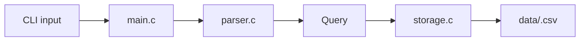
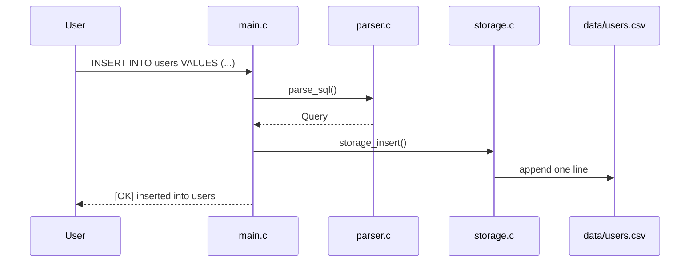
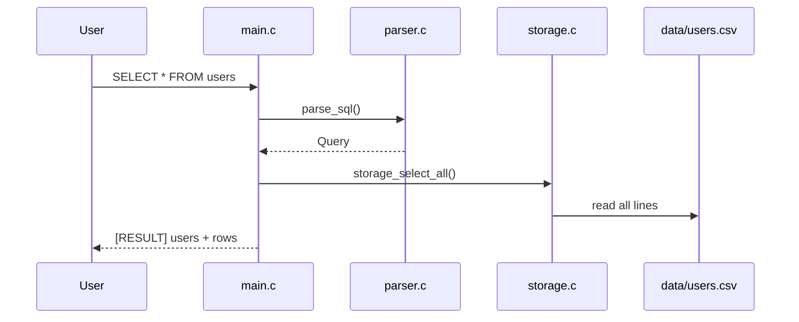

# Simple SQL Processor in C

This project is a very small SQL processor for education and assignments.
It does not try to behave like a full DBMS.
It only supports the minimum required flow:

- read SQL from CLI or file
- parse the SQL string directly
- execute `INSERT` or `SELECT`
- store table data in CSV files

Supported SQL:

- `INSERT INTO users VALUES (1, 'woo');`
- `INSERT INTO users VALUES (2, 'alice', 25);`
- `SELECT * FROM users;`

Not supported:

- `CREATE TABLE`
- AST
- separate lexer
- index or B-Tree
- `WHERE`
- `UPDATE`, `DELETE`

## Design Idea

The project keeps the structure intentionally simple:

1. `main.c`
   Handles CLI input and runs the query.
2. `parser.c`
   Parses the SQL string directly into a `Query` structure.
3. `storage.c`
   Saves and reads CSV files.
4. `query.h`
   Defines the shared `Query` structure.



## Project Structure

- `main.c`
- `parser.c`, `parser.h`
- `storage.c`, `storage.h`
- `query.h`
- `Makefile`
- `examples/`
- `data/`
- `docs/architecture.md`

## File Responsibilities

- `main.c`
  Reads arguments, loads SQL text, calls parser, and executes the query.
- `parser.c`
  Checks whether the SQL is `INSERT` or `SELECT`, then fills a `Query`.
- `storage.c`
  Maps table names to CSV files and performs append or full read.
- `query.h`
  Defines `QueryType`, `Query`, and common size limits.

## Query Structure

```c
typedef enum {
    QUERY_INSERT = 0,
    QUERY_SELECT,
    QUERY_UNKNOWN
} QueryType;

typedef struct {
    QueryType type;
    char table_name[MAX_TABLE_NAME_LENGTH];
    char values[MAX_VALUES][MAX_VALUE_LENGTH];
    int value_count;
} Query;
```

This is enough because the project only needs:

- query type
- target table
- inserted values

## How It Works

### INSERT flow



### SELECT flow



## CSV Storage Rule

Each table is one CSV file:

- `users` -> `data/users.csv`
- `orders` -> `data/orders.csv`

Example:

```text
INSERT INTO users VALUES (1, 'woo');
INSERT INTO users VALUES (2, 'alice');
```

Stored as:

```text
1,woo
2,alice
```

## Build

```bash
make
```

Or:

```bash
gcc -Wall -Wextra -std=c11 -pedantic -o sql_processor main.c parser.c storage.c
```

## Run

### Pass SQL directly

```bash
./sql_processor "INSERT INTO users VALUES (1, 'woo');"
./sql_processor "SELECT * FROM users;"
```

### Pass SQL file

```bash
./sql_processor -f examples/01_insert_woo.sql
./sql_processor -f examples/03_select_users.sql
```

## Test Examples

Included files:

1. `examples/01_insert_woo.sql`
2. `examples/02_insert_alice.sql`
3. `examples/03_select_users.sql`
4. `examples/04_invalid.sql`
5. `examples/05_select_missing.sql`

```bash
./sql_processor -f examples/01_insert_woo.sql
./sql_processor -f examples/02_insert_alice.sql
./sql_processor -f examples/03_select_users.sql
./sql_processor -f examples/04_invalid.sql
./sql_processor -f examples/05_select_missing.sql
```

## Why This Version Is Simple

- no AST
- no lexer module
- no optimizer
- no index
- no B-Tree
- no schema engine

The parser directly reads the SQL string, and the storage layer directly reads or writes CSV files.

## Core Explanation Points

1. SQL parsing method  
   `parser.c` checks keywords like `INSERT`, `INTO`, `VALUES`, `SELECT`, and `FROM` directly.

2. INSERT execution  
   `main.c` sends the parsed query to `storage_insert()`, which appends a CSV row.

3. SELECT execution  
   `main.c` sends the parsed query to `storage_select_all()`, which reads the whole CSV file and prints it.

4. CSV storage method  
   One table corresponds to one CSV file, and one `INSERT` corresponds to one line.

## Limitations

- only supports a tiny SQL subset
- no schema validation
- no type checking
- full scan only
- no condition search

## Extension Ideas

- multiple SQL statements in one file
- simple column count validation
- `WHERE`
- `UPDATE`, `DELETE`
