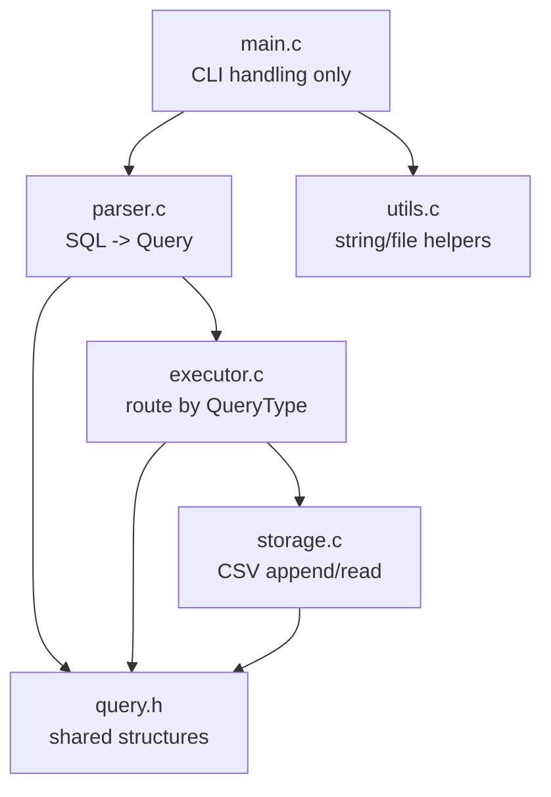
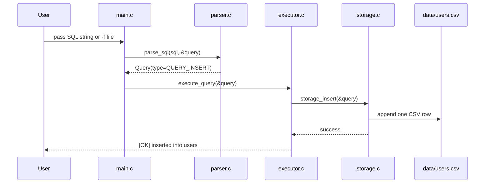
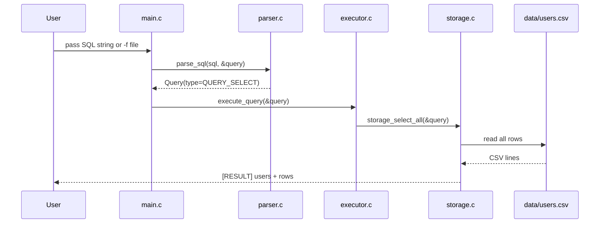
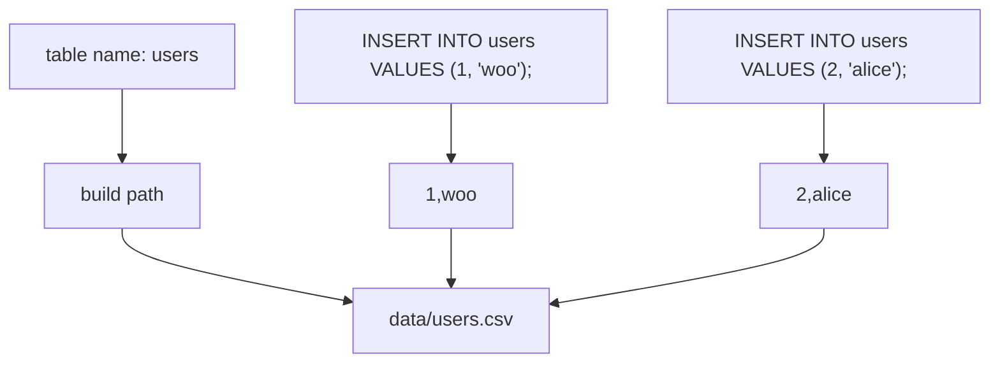
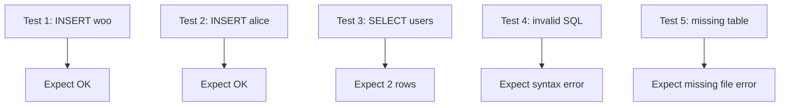

# Simple SQL Processor in C

This project is a small educational SQL processor written in C.
It accepts a SQL string or a SQL file from the command line, parses a limited SQL grammar, executes the query, and stores table data in CSV files.

Supported SQL:

- `INSERT INTO table VALUES (...)`
- `SELECT * FROM table;`

Not supported:

- `CREATE TABLE`
- `WHERE`
- column-specific `SELECT`
- `UPDATE`
- `DELETE`

## Design Summary

The design is intentionally simple and presentation-friendly.
Instead of building a full DBMS, the program is split into four easy-to-explain layers:

1. CLI input handling
2. SQL parsing
3. Query execution
4. CSV file storage


## Project Structure

- `main.c`
  Thin entry point. Reads CLI arguments, loads SQL text, calls parser and executor.
- `query.h`
  Shared query model and constants such as `QueryType`, max lengths, and data directory.
- `parser.c`, `parser.h`
  Converts SQL text into a `Query` structure.
- `executor.c`, `executor.h`
  Dispatches parsed queries to storage functions.
- `storage.c`, `storage.h`
  Handles CSV append and CSV read operations.
- `utils.c`, `utils.h`
  Helper functions for trimming, string copy, file reading, and argument joining.
- `examples/`
  Example SQL files for feature tests.
- `data/`
  CSV files used as table storage.
- `docs/architecture.md`
  Detailed architecture and diagrams for presentation or report use.
- `Makefile`
  Build and test commands.

## Module Responsibilities



## Query Model

The core data model is the `Query` structure declared in `query.h`.

```c
typedef enum {
    QUERY_INSERT = 0,
    QUERY_SELECT,
    QUERY_UNKNOWN
} QueryType;

typedef struct {
    QueryType type;
    char table_name[MAX_TABLE_NAME_LENGTH];
    char values[MAX_VALUES][MAX_VALUE_LENGTH];
    int value_count;
    int select_all;
    char raw_sql[MAX_SQL_LENGTH];
} Query;
```

Why this is useful:

- one structure represents both supported SQL commands
- executor logic stays simple
- parser and storage are loosely coupled
- the code is easy to explain in a class presentation

## Execution Flow

### INSERT flow



### SELECT flow



## CSV Storage Model

Each table is managed by exactly one CSV file.

- `users` -> `data/users.csv`
- `orders` -> `data/orders.csv`



Example file content:

```text
1,woo
2,alice
```

## CLI Usage

### Pass SQL directly

```bash
./sql_processor "INSERT INTO users VALUES (1, 'woo');"
./sql_processor "SELECT * FROM users;"
```

### Pass a SQL file

```bash
./sql_processor -f examples/01_insert_woo.sql
./sql_processor -f examples/03_select_users.sql
```

## Build

```bash
make
```

Direct compile command:

```bash
gcc -Wall -Wextra -std=c11 -pedantic -o sql_processor main.c parser.c executor.c storage.c utils.c
```

## Test Scenarios

Use the included example SQL files:

1. `examples/01_insert_woo.sql`
2. `examples/02_insert_alice.sql`
3. `examples/03_select_users.sql`
4. `examples/04_invalid.sql`
5. `examples/05_select_missing.sql`



Run them one by one:

```bash
./sql_processor -f examples/01_insert_woo.sql
./sql_processor -f examples/02_insert_alice.sql
./sql_processor -f examples/03_select_users.sql
./sql_processor -f examples/04_invalid.sql
./sql_processor -f examples/05_select_missing.sql
```

Or run:

```bash
make test
```

## Error Handling

The code includes explicit error handling for:

- empty SQL input
- unsupported SQL syntax
- unterminated quoted strings
- too many values
- table file not found
- CSV write failure
- malformed CSV rows

Example output:

```text
[ERROR] invalid SQL syntax
[ERROR] table file not found: data/missing_table.csv
```

## Why This Structure Works Well

- `main.c` stays thin and easy to explain
- parsing, execution, and storage are clearly separated
- the code is small enough for an assignment
- each module has a single responsibility
- extension points are obvious

## Limitations

- no schema validation
- no type checking
- no column name support
- no multiple statements in one input
- no `WHERE`, `UPDATE`, or `DELETE`

## Extension Ideas

- `SELECT name FROM users;`
- `WHERE id = 1`
- schema file support
- column count validation
- multiple SQL statements in one file
- `UPDATE` and `DELETE`

## More Detailed Docs

See `docs/architecture.md` for a fuller explanation with more diagrams and speaking points.
