# Simple SQL Processor in C

작은 교육용 SQL Processor 예제입니다.  
이 프로젝트는 "진짜 DBMS"를 구현하려는 것이 아니라, **SQL 입력 -> 파싱 -> 실행 -> 파일 저장/조회**라는 핵심 흐름을 C로 이해하기 쉽게 구현하는 데 목적이 있습니다.

지원 SQL:

- `INSERT INTO users VALUES (1, 'woo');`
- `INSERT INTO users VALUES (2, 'alice', 25);`
- `SELECT * FROM users;`

지원하지 않는 기능:

- `CREATE TABLE`
- AST
- 별도 Lexer
- Optimizer
- Index / B-Tree
- `WHERE`
- `UPDATE`, `DELETE`

---

## 1. 프로젝트 목표

이 프로젝트의 목표는 아래 4가지를 명확하게 보여주는 것입니다.

1. CLI에서 SQL 문자열 또는 SQL 파일 입력받기
2. SQL 문자열을 직접 파싱해서 `Query` 구조체로 변환하기
3. `INSERT` / `SELECT`를 분기해서 실행하기
4. 테이블 데이터를 CSV 파일로 저장하고 다시 읽어오기

즉, 이 프로젝트는 복잡한 DB 기능보다 **구조의 명확함**과 **설명 가능성**을 우선합니다.

---

## 2. 전체 구조 한눈에 보기

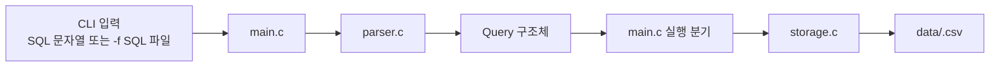

핵심 아이디어는 단순합니다.

- `main.c`: 입력을 받음
- `parser.c`: SQL을 해석함
- `Query`: 해석 결과를 담음
- `storage.c`: CSV 파일에 저장/조회함

---

## 3. 왜 이렇게 단순하게 만들었는가

이 과제에서는 아래와 같은 고급 DB 개념이 필수가 아닙니다.

- AST
- Tokenizer / Lexer
- Query Optimizer
- 인덱스
- B-Tree
- 트랜잭션

그래서 이번 구현은 **직접 문자열을 파싱하는 방식**을 선택했습니다.  
발표나 과제 설명에서 오히려 이 방식이 더 좋습니다.

이유:

- 구조를 설명하기 쉽다
- 파일 수가 적고 이해가 빠르다
- SQL의 최소 문법만 안정적으로 처리할 수 있다
- 과제 범위를 넘는 복잡도를 피할 수 있다

---

## 4. 프로젝트 디렉터리 구조

```text
codex_project14/
├─ main.c
├─ parser.c
├─ parser.h
├─ storage.c
├─ storage.h
├─ query.h
├─ Makefile
├─ README.md
├─ docs/
│  └─ architecture.md
├─ examples/
│  ├─ 01_insert_woo.sql
│  ├─ 02_insert_alice.sql
│  ├─ 03_select_users.sql
│  ├─ 04_invalid.sql
│  └─ 05_select_missing.sql
└─ data/
   └─ users.csv
```

---

## 5. 파일별 책임

### `main.c`

- 프로그램 시작점
- CLI 인자 처리
- SQL 문자열 직접 입력 / SQL 파일 입력 둘 다 지원
- `parse_sql()` 호출
- 파싱 결과에 따라 `INSERT` 또는 `SELECT` 실행
- 사용자에게 최종 출력 메시지 표시

### `parser.c`

- SQL 문자열을 직접 읽어 문법을 확인
- `INSERT`, `INTO`, `VALUES`, `SELECT`, `FROM` 같은 키워드를 검사
- 테이블 이름과 값 목록을 추출
- 결과를 `Query` 구조체에 저장

### `storage.c`

- 테이블 이름을 실제 CSV 파일 경로로 변환
- `INSERT`일 때 CSV 한 줄 추가
- `SELECT`일 때 CSV 전체를 읽어서 출력
- CSV 값에 쉼표나 큰따옴표가 있을 때도 저장 가능하도록 처리

### `query.h`

- 공통 상수 정의
- `QueryType` enum 정의
- `Query` 구조체 정의

---

## 6. Query 자료구조 설명

이 프로젝트의 핵심 자료구조는 `Query`입니다.

```c
typedef enum {
    QUERY_INSERT = 0,
    QUERY_SELECT,
    QUERY_UNKNOWN
} QueryType;

typedef struct {
    QueryType type;
    char table_name[MAX_TABLE_NAME_LENGTH];
    char values[MAX_VALUES][MAX_VALUE_LENGTH];
    int value_count;
} Query;
```

### 각 필드의 의미

- `type`
  어떤 종류의 쿼리인지 저장합니다.
  예: `QUERY_INSERT`, `QUERY_SELECT`

- `table_name`
  대상 테이블 이름을 저장합니다.
  예: `users`

- `values`
  `INSERT`의 값 목록을 문자열 배열로 저장합니다.
  예: `1`, `woo`, `25`

- `value_count`
  실제로 몇 개의 값이 들어왔는지 저장합니다.

### 왜 이 정도만 있어도 충분한가

이번 과제는 아래만 필요합니다.

- 쿼리 종류
- 대상 테이블
- 삽입 값 목록

즉, AST처럼 복잡한 트리 구조 없이도 `Query` 하나면 충분합니다.

---

## 7. 전체 실행 흐름

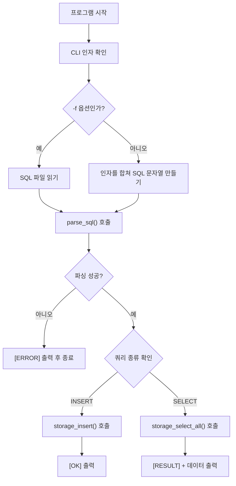

이 흐름을 발표 때 한 문장으로 설명하면:

> 입력을 받은 뒤 SQL을 직접 파싱해서 `Query` 구조체로 만들고, 쿼리 타입에 따라 CSV 파일에 저장하거나 CSV 전체를 읽어 출력한다.

---

## 8. `main.c` 상세 설명

`main.c`는 최대한 얇게 유지하되, 과제 수준에서 필요한 실행 제어는 직접 담당합니다.

### `main.c`가 하는 일

1. 프로그램 사용법 안내
2. SQL 문자열 직접 입력 또는 파일 입력 처리
3. 파싱 호출
4. 실행 분기
5. 결과 메시지 출력

### `main.c` 내부 흐름

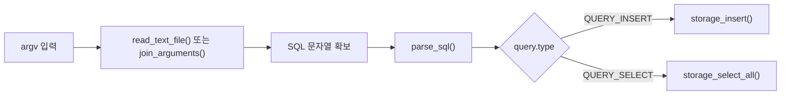

### `main.c`에서 중요한 점

- SQL 파일 입력과 SQL 문자열 입력을 둘 다 지원
- 파싱 실패와 실행 실패를 구분해서 에러 메시지 출력
- 과제 요구사항에 맞게 `main`이 너무 무거워지지 않도록 핵심 흐름만 유지

---

## 9. `parser.c` 상세 설명

이번 프로젝트의 parser는 일반적인 SQL parser가 아닙니다.  
오직 이번 과제에 필요한 최소 문법만 직접 처리합니다.

### parser가 지원하는 문법

#### INSERT

```sql
INSERT INTO users VALUES (1, 'woo');
INSERT INTO users VALUES (1, 'woo', 25);
```

#### SELECT

```sql
SELECT * FROM users;
```

### parser가 처리하는 순서

1. 앞뒤 공백 제거
2. 마지막 세미콜론 제거
3. 첫 키워드가 `INSERT`인지 `SELECT`인지 판별
4. 쿼리 종류에 맞춰 세부 문법 검사

### parser 내부 흐름

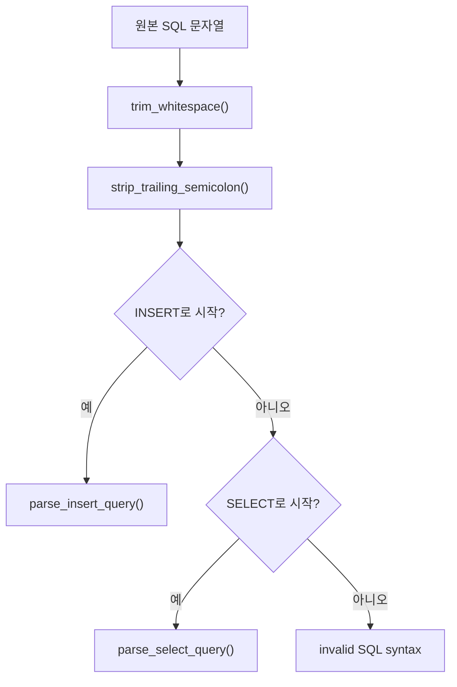

### INSERT 파싱 흐름


### SELECT 파싱 흐름


### 문자열 값 처리 방식

예를 들어:

```sql
INSERT INTO users VALUES (1, 'woo');
```

parser는 다음처럼 처리합니다.

- `1` -> 일반 값
- `'woo'` -> 작은따옴표 문자열 값

작은따옴표 안의 문자열은 `parse_quoted_value()`가 읽고,
숫자처럼 따옴표 없는 값은 `parse_unquoted_value()`가 읽습니다.

### parser가 검사하는 에러 예시

- 빈 SQL 입력
- 잘못된 키워드
- `INTO` 누락
- `VALUES` 누락
- `FROM` 누락
- 빈 값 목록
- 닫히지 않은 따옴표
- 예상하지 못한 뒤쪽 문자열

---

## 10. `storage.c` 상세 설명

`storage.c`는 테이블 이름을 CSV 파일과 연결하고, 파일에 데이터를 저장하거나 읽는 역할을 맡습니다.

### 테이블과 파일의 대응 관계

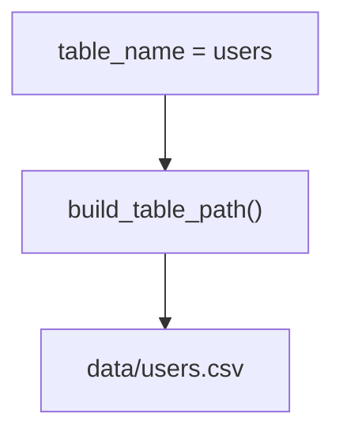

즉:

- `users` 테이블 -> `data/users.csv`
- `orders` 테이블 -> `data/orders.csv`

### INSERT 저장 흐름

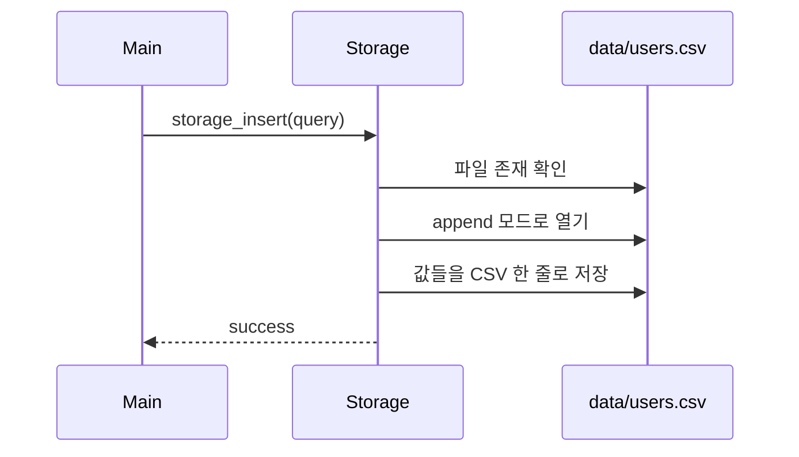

### SELECT 조회 흐름

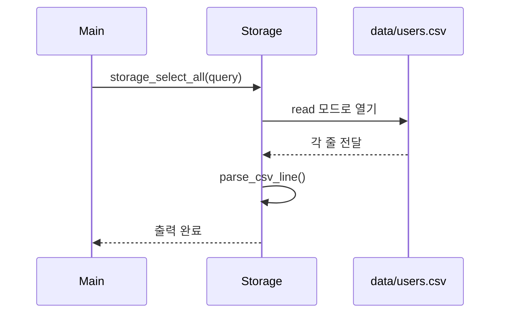

### CSV 저장 방식

예:

```sql
INSERT INTO users VALUES (1, 'woo');
INSERT INTO users VALUES (2, 'alice');
```

실제 저장:

```text
1,woo
2,alice
```

### 쉼표와 큰따옴표 처리

값 안에 쉼표나 큰따옴표가 들어갈 수도 있으므로 `write_csv_field()`에서 CSV 규칙을 지킵니다.

예:

```text
hello,world
```

이 값은 저장 시:

```text
"hello,world"
```

처럼 큰따옴표로 감쌉니다.

### SELECT에서 CSV를 다시 파싱하는 이유

파일에 저장된 줄을 그대로 출력할 수도 있지만, CSV 규칙을 고려하면 값을 다시 읽어 나누는 과정이 더 안전합니다.  
그래서 `parse_csv_line()`이 한 줄을 읽어서 필드 단위로 분리한 뒤 출력합니다.

---

## 11. INSERT 동작 예시

입력:

```bash
./sql_processor "INSERT INTO users VALUES (1, 'woo');"
```

내부 동작:

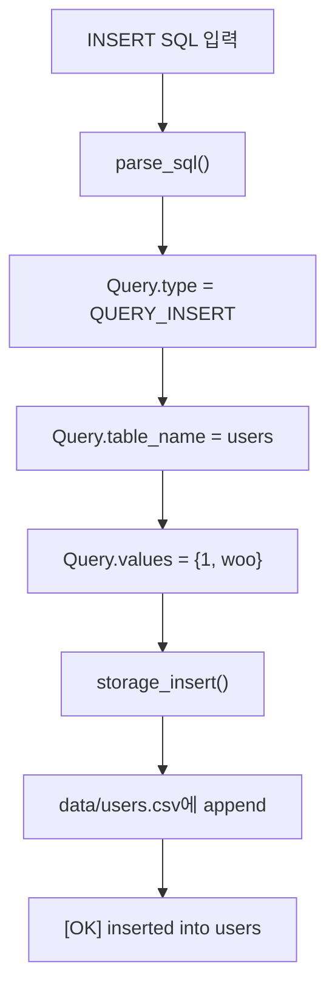

결과:

```text
[OK] inserted into users
```

파일 내용:

```text
1,woo
```

---

## 12. SELECT 동작 예시

입력:

```bash
./sql_processor "SELECT * FROM users;"
```

내부 동작:

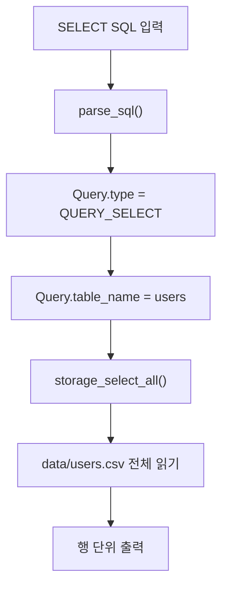

결과:

```text
[RESULT] users
1,woo
2,alice
```

---

## 13. CLI 입력 방식

이 프로젝트는 두 가지 입력 방식을 지원합니다.

### 1) SQL 문자열 직접 입력

```bash
./sql_processor "INSERT INTO users VALUES (1, 'woo');"
./sql_processor "SELECT * FROM users;"
```

### 2) SQL 파일 입력

```bash
./sql_processor -f examples/01_insert_woo.sql
./sql_processor -f examples/03_select_users.sql
```

### 두 방식의 흐름 비교

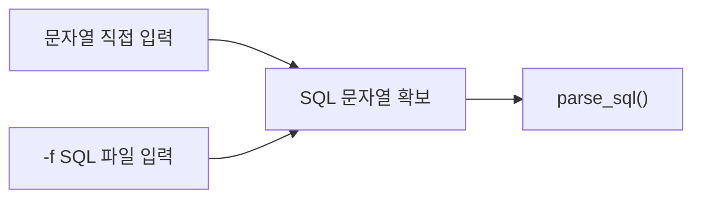

---

## 14. 테스트 예제 설명

프로젝트에는 기본 기능 테스트용 SQL 파일이 포함되어 있습니다.

### 테스트 파일 목록

1. `examples/01_insert_woo.sql`
2. `examples/02_insert_alice.sql`
3. `examples/03_select_users.sql`
4. `examples/04_invalid.sql`
5. `examples/05_select_missing.sql`

### 테스트 목적

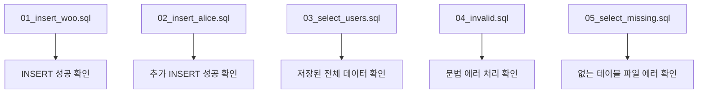

### 테스트 실행 예시

```bash
./sql_processor -f examples/01_insert_woo.sql
./sql_processor -f examples/02_insert_alice.sql
./sql_processor -f examples/03_select_users.sql
./sql_processor -f examples/04_invalid.sql
./sql_processor -f examples/05_select_missing.sql
```

---

## 15. 에러 처리 방식

이 프로젝트는 조용히 실패하지 않고, 사람이 이해할 수 있는 에러 메시지를 출력하도록 설계했습니다.

### 에러 흐름

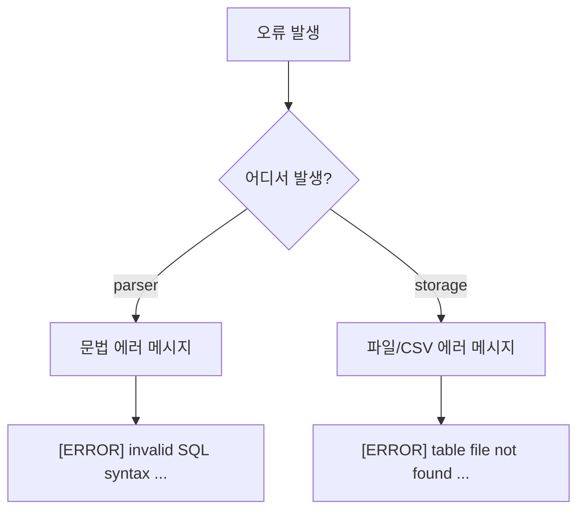

### 대표 에러 예시

```text
[ERROR] invalid SQL syntax
[ERROR] invalid SQL syntax: expected VALUES
[ERROR] invalid SQL syntax: unterminated quoted string
[ERROR] table file not found: data/users.csv
```

---

## 16. 빌드 방법

### Makefile 사용

```bash
make
```

### 직접 컴파일

```bash
gcc -Wall -Wextra -std=c11 -pedantic -o sql_processor main.c parser.c storage.c
```

### 컴파일 옵션 설명

- `-Wall`
  일반적인 경고 활성화
- `-Wextra`
  추가 경고 활성화
- `-std=c11`
  C11 표준 사용
- `-pedantic`
  표준에서 벗어난 문법 사용을 더 엄격하게 검사

---

## 17. 구현에서 중요한 함수들

### `main.c`

- `read_text_file()`
  SQL 파일을 읽어서 버퍼에 저장

- `join_arguments()`
  CLI 인자 여러 개를 하나의 SQL 문자열로 결합

- `execute_query()`
  `QUERY_INSERT`면 `storage_insert()`
  `QUERY_SELECT`면 `storage_select_all()` 호출

### `parser.c`

- `parse_sql()`
  전체 파싱 시작점

- `parse_insert_query()`
  `INSERT INTO ... VALUES (...)` 처리

- `parse_select_query()`
  `SELECT * FROM ...` 처리

- `parse_value_list()`
  괄호 안 값 목록 처리

- `parse_quoted_value()`
  `'woo'` 같은 문자열 값 처리

- `parse_unquoted_value()`
  `1`, `25` 같은 일반 값 처리

### `storage.c`

- `build_table_path()`
  테이블 이름을 CSV 파일 경로로 변환

- `storage_insert()`
  CSV 한 줄 추가

- `storage_select_all()`
  CSV 전체 읽기 및 출력

- `write_csv_field()`
  CSV 규칙에 맞게 값 저장

- `parse_csv_line()`
  한 줄 CSV를 필드 단위로 분리

---

## 18. 왜 이 구조가 과제에 적합한가

이 구조는 단순하지만 역할 분리가 분명합니다.

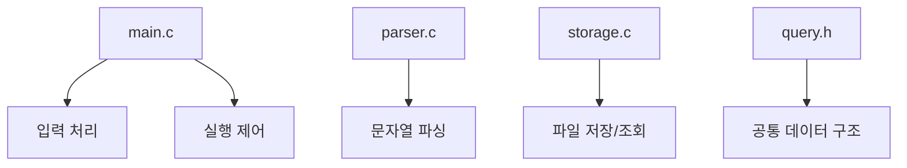

장점:

- 설명하기 쉽다
- 발표용으로 구조가 깔끔하다
- SQL 처리 흐름이 잘 드러난다
- 파일 기반 저장 구조가 직관적이다
- 확장 방향도 명확하다

---

## 19. 한계점

이 프로젝트는 교육용 구현이므로 아래 한계가 있습니다.

- SQL 일부만 지원
- 컬럼 이름을 다루지 않음
- 스키마 검증 없음
- 타입 검증 없음
- 조건 검색 없음
- 전체 조회는 항상 Full Scan
- 여러 사용자의 동시 접근 처리 없음

즉, 실제 DBMS와 같은 고급 기능은 의도적으로 제외했습니다.

---

## 20. 확장 아이디어

다음 단계로는 아래 확장이 가능합니다.

- 한 파일에 여러 SQL 문장 실행
- 컬럼 수 검증
- `WHERE` 추가
- 특정 컬럼 `SELECT`
- `UPDATE`, `DELETE`
- 간단한 스키마 파일 추가

하지만 이번 버전은 **과제 범위에 맞게 단순함을 유지하는 것**이 핵심입니다.

---

## 21. 발표용 요약 문장

아래처럼 설명하면 자연스럽습니다.

> 이 프로젝트는 SQL 문자열을 직접 파싱해서 `Query` 구조체로 만든 뒤, `INSERT`면 CSV 파일에 한 줄 추가하고, `SELECT`면 CSV 파일 전체를 읽어 출력하는 아주 단순한 SQL Processor입니다. AST, lexer, 인덱스 같은 고급 구조는 사용하지 않고, 과제 범위에 맞는 최소 기능만 명확하게 구현했습니다.
