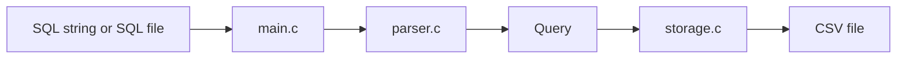
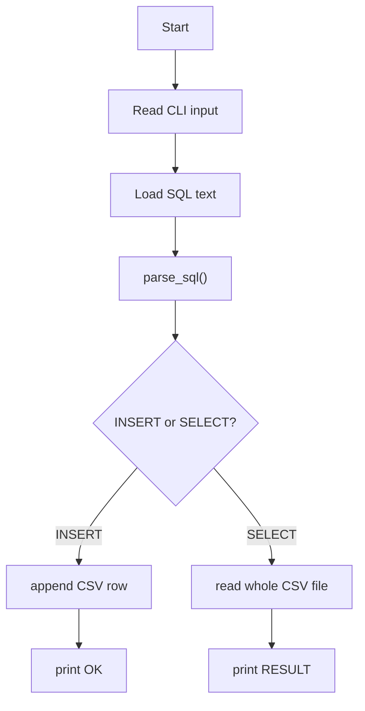

# Simple Architecture Notes

This version is intentionally reduced to match a basic assignment scope.

## 1. Main Point

This is not a full DBMS.
It is a tiny SQL processor with direct parsing and CSV storage.

There is:

- no AST
- no lexer
- no optimizer
- no index
- no B-Tree

## 2. Minimal Architecture

## 3. File Roles

| File | Role |
| --- | --- |
| `main.c` | input handling and query execution |
| `parser.c` | direct SQL parsing |
| `storage.c` | CSV save and read |
| `query.h` | shared query structure |

## 4. Processing Flow

## 5. Why This Design Fits the Assignment

- easy to explain
- easy to compile
- easy to test
- enough separation between parsing and storage
- no unnecessary advanced DB concepts

## 6. Speaking Version

You can explain it like this:

“이 프로젝트는 SQL 문자열을 직접 파싱해서 Query 구조체로 만들고, INSERT면 CSV 파일에 한 줄 추가하고, SELECT면 CSV 파일 전체를 읽어서 출력하는 아주 단순한 구조입니다. AST, lexer, 인덱스 같은 복잡한 구성은 사용하지 않았습니다.”
