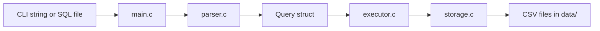
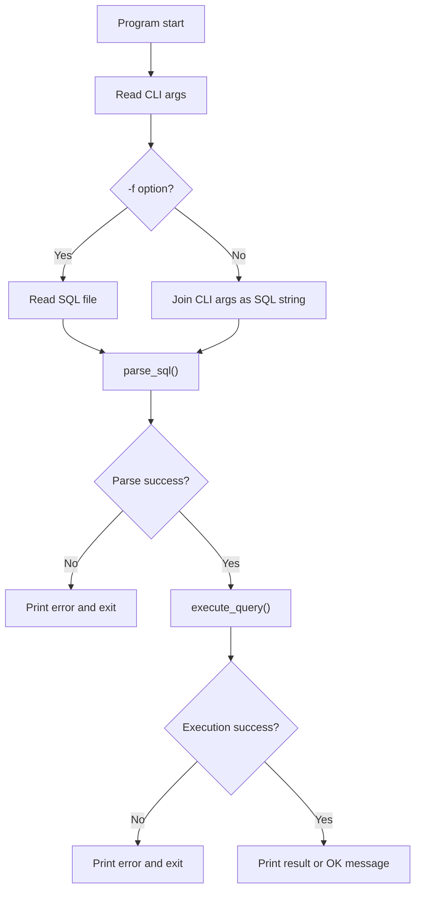
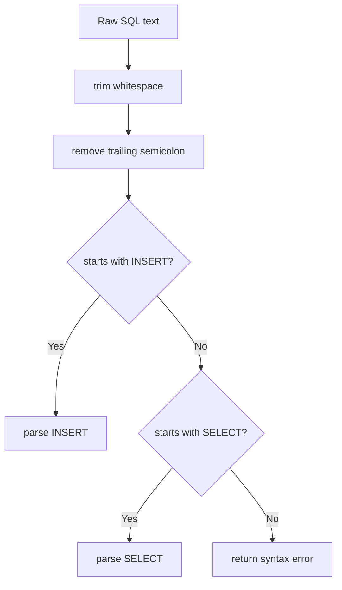
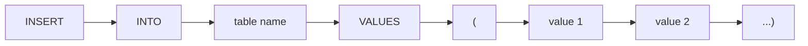
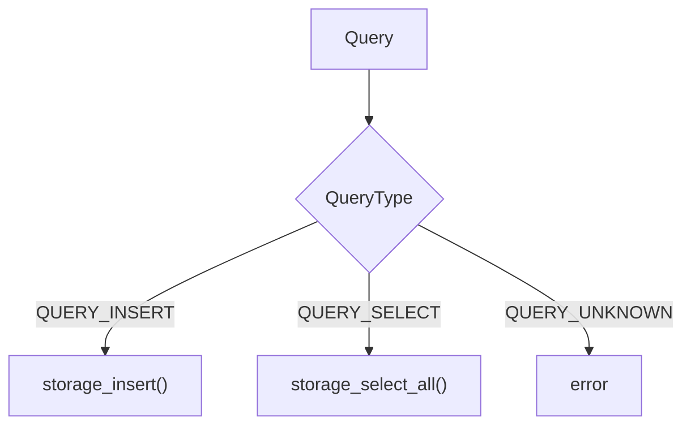
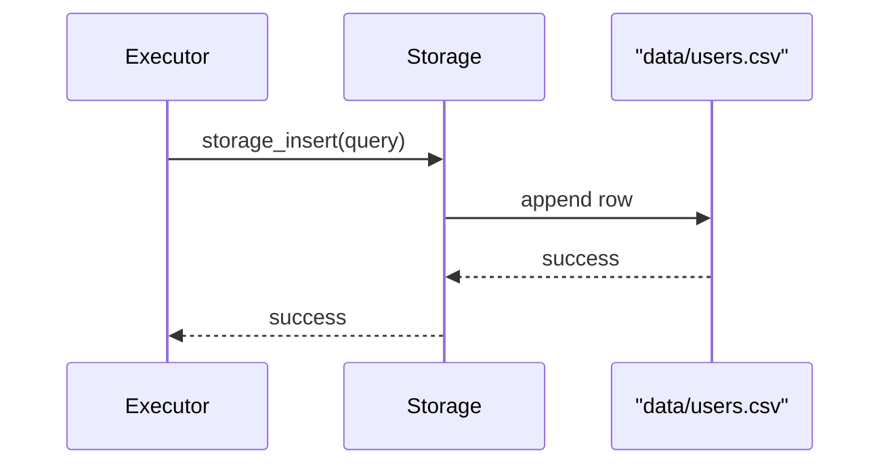
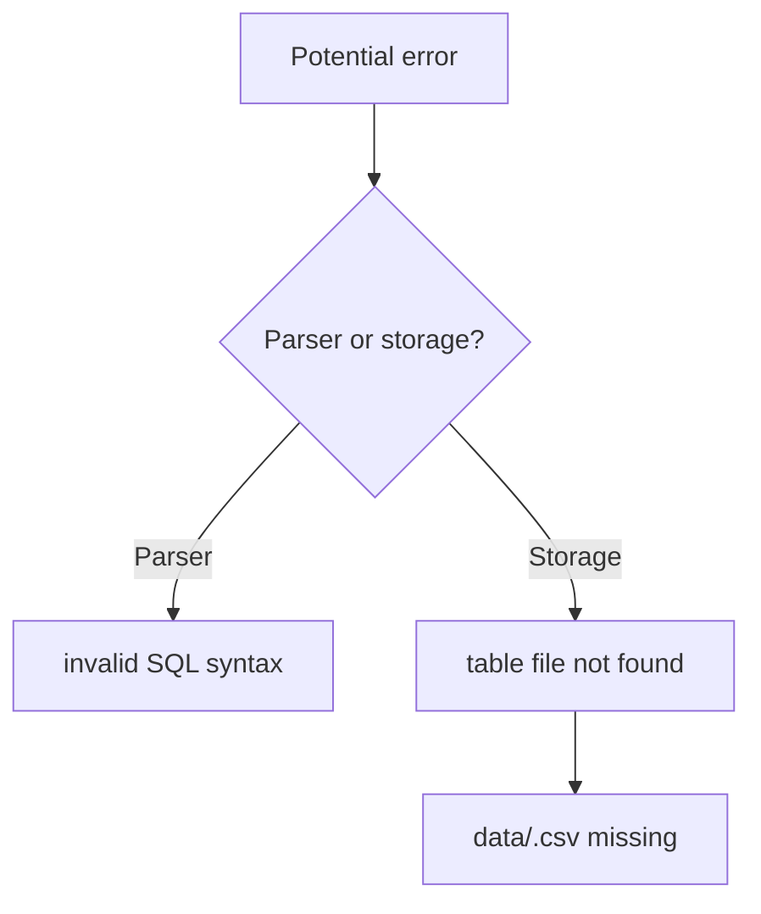
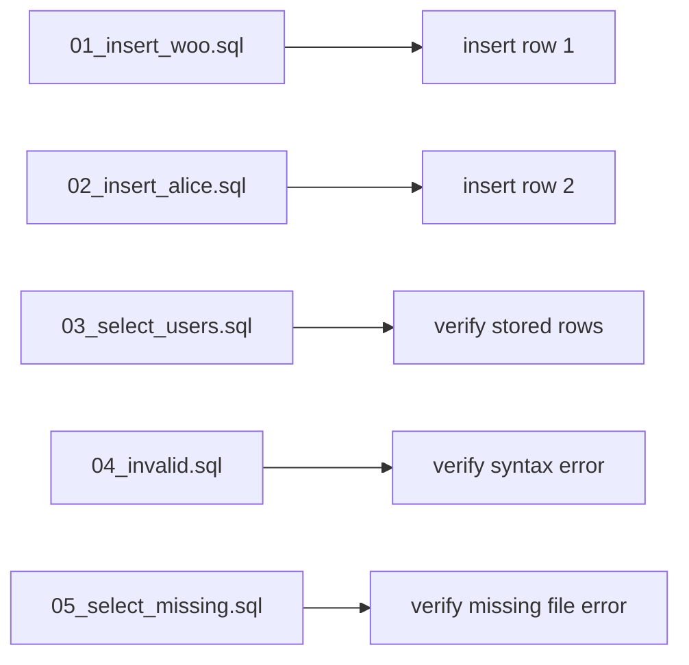

# Architecture Notes and Presentation Guide

This document explains the internal design of the SQL processor in a report-friendly format.

## 1. Goal

The goal is to implement a tiny SQL processor in C that:

- accepts SQL from the command line or a file
- parses limited SQL statements
- executes them against file-based storage
- stores each table as a CSV file

This is not a real DBMS.
It is a clean educational implementation that focuses on structure and readability.

## 2. High-Level Architecture

## 3. File-by-File Responsibility

| File | Responsibility |
| --- | --- |
| `main.c` | Reads arguments and coordinates the full workflow |
| `query.h` | Defines query types, query data structure, and size constants |
| `parser.c` | Parses SQL text into a `Query` object |
| `executor.c` | Decides what action to perform based on query type |
| `storage.c` | Reads and writes CSV table files |
| `utils.c` | Helper functions for string cleanup and file loading |
| `examples/` | Feature test SQL files |
| `data/` | Physical table storage |

## 4. Detailed Control Flow

### Overall request flow

### Parser logic

## 5. INSERT Parsing Strategy

The parser is not a generic SQL parser.
It only handles the exact assignment grammar:

- `INSERT INTO users VALUES (1, 'woo');`
- `INSERT INTO users VALUES (1, 'woo', 25);`

Processing steps:

1. verify `INSERT`
2. verify `INTO`
3. parse table name
4. verify `VALUES`
5. parse the value list inside `(...)`
6. store each parsed value in `query.values`

## 6. SELECT Parsing Strategy

The supported form is intentionally minimal:

- `SELECT * FROM users;`

The parser verifies:

1. `SELECT`
2. `*`
3. `FROM`
4. table name

If any extra clause exists, the parser rejects it.

## 7. Execution Layer

The executor keeps business logic simple.
It only checks `query.type` and forwards the request to storage.

Why this matters:

- parser and storage do not depend on each other directly
- the dispatch logic is easy to demonstrate in a presentation
- future query types can be added with a new `case`

## 8. Storage Layer

Each logical table is mapped to exactly one CSV file.

Path rule:

- `users` -> `data/users.csv`

### INSERT storage behavior

For `INSERT INTO users VALUES (1, 'woo');`

1. build file path `data/users.csv`
2. verify the file exists
3. open the file in append mode
4. write one CSV row
5. print success

### SELECT storage behavior

For `SELECT * FROM users;`

1. build file path `data/users.csv`
2. open file in read mode
3. read all lines
4. parse CSV columns for each line
5. print rows

## 9. CSV Format Design

CSV is used because it is easy to inspect and simple to explain.

Advantages:

- plain text
- easy append for INSERT
- easy line-based read for SELECT
- no external libraries needed

CSV writing rules in this project:

- normal values are written directly
- values containing comma, quote, or newline are quoted
- inner quotes are escaped by doubling them

Example:

| SQL input | stored CSV |
| --- | --- |
| `INSERT INTO users VALUES (1, 'woo');` | `1,woo` |
| `INSERT INTO users VALUES (3, 'hello,world');` | `3,"hello,world"` |

## 10. Error Handling Design

The project returns readable error messages instead of failing silently.

Main error cases:

- invalid SQL syntax
- missing `INTO`, `VALUES`, or `FROM`
- invalid table name
- empty value list
- missing table file
- malformed CSV row

## 11. Test Strategy

The included examples form a simple functional test set.

This gives coverage for:

- valid INSERT
- valid SELECT
- parser failure
- storage failure

## 12. Presentation Talking Points

You can explain the project in this order:

1. This is a mini SQL processor, not a full DBMS.
2. The input path supports both SQL strings and SQL files.
3. The parser converts text into a structured `Query`.
4. The executor separates control flow from storage details.
5. The storage layer maps each table to one CSV file.
6. INSERT appends a row and SELECT reads the full file.
7. The structure is intentionally modular so future features can be added.

## 13. Future Extensions

Good next steps:

- add `WHERE`
- support specific column lists
- validate schema and column counts
- support multiple statements per file
- add `UPDATE` and `DELETE`
